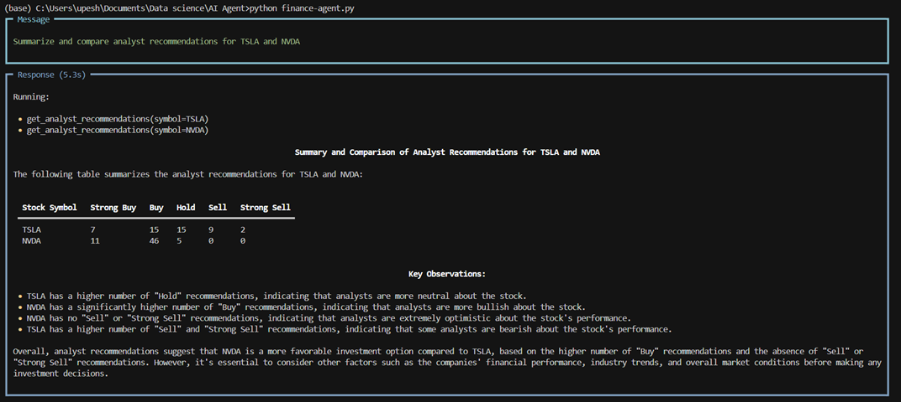
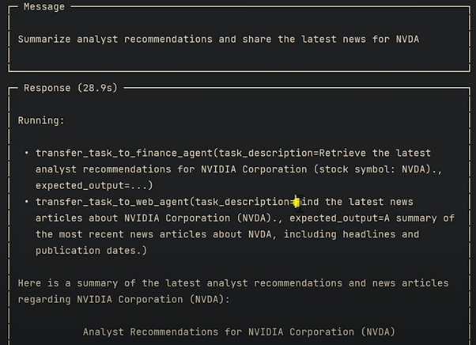

# AI Agents with Phi and Groq

This project demonstrates the implementation of AI agents using the Phi library with both OpenAI and Groq models. It includes various agent configurations from simple text generation to complex financial analysis and web search capabilities.


## Single Finance Agent
This implementation uses Groq's LLM to analyze financial data using YFinance tools.

 

### Features
- Stock price analysis
- Analyst recommendations
- Stock fundamentals
- Structured table output

## Finance Agent Team
An advanced implementation that combines multiple agents for comprehensive analysis.



### Features
- Web Agent for internet searches using DuckDuckGo
- Finance Agent for detailed financial analysis
- Team coordination for comprehensive responses
- Markdown formatting for readable output

## Setup and Installation

1. Clone the repository
2. Install dependencies:
```bash
pip install -r requirements.txt
```

3. Create a `.env` file with your API keys:
```env
GROQ_API_KEY=your_groq_api_key_here
OPENAI_API_KEY=your_openai_api_key_here  # If using OpenAI models
```

## Usage Examples

### Simple Groq Agent
```python
python simple_groq_agent.py
```
Generates creative text responses using Groq's LLM.

### Finance Agent
```python
python Finance-agent.py
```
Analyzes financial data for specified stocks.

### Finance Agent Team
```python
python finance_agent_team.py
```
Provides comprehensive analysis combining web search and financial data.
